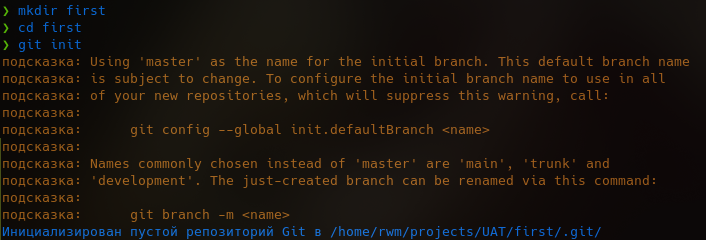
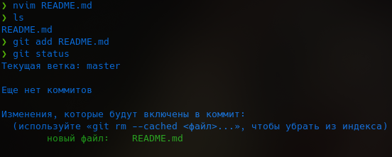
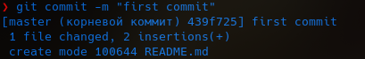
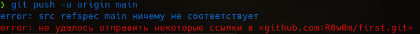

# My first repository(no)
Repository created 16 Sep. by Ramil Ziganshin

---
[Cats](./cool_cats/README.md)
---
1. Создание папки и инициализация git

	

2. Добавление файла README.md

	

3. Коммитим

	

4. Пуш на сервер

	

	Вылезла ошибка т.к. ветки на GitHub(main) и в локаьном репозитории(master) отличаются. Для этого используем команду `git branch -M main` для переименования master => main

	

5. Аналогично добавляем другие файлы.
